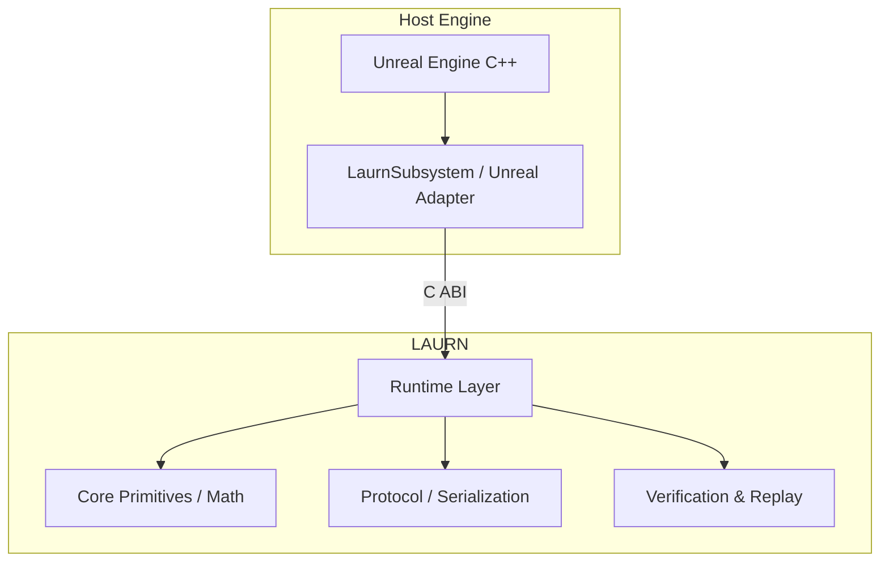

# LAURN

[](https://github.com/laurrybin/Laurn/actions)
[](https://opensource.org/licenses/Apache-2.0)
[]()

LAURN is a deterministic, verifiable state-transition runtime designed for multiplayer simulations. It provides a shared verification layer, ensuring that state transitions conform strictly to an agreed-upon authority, epoch, policy, and simulation model.

## Overview

LAURN operates as a standalone cryptographic state engine. It accepts deterministic inputs (transitions) and computes rigorous, mathematically verifiable state outputs (commitments). It is designed to be embedded within real-time engines, providing authoritative state management without relying on consensus mechanisms or blockchain architecture.

## Architecture

LAURN is composed of a Rust core and exposes a flat C ABI for engine integrations.



## Prerequisites

- **Rust**: `1.75.0` or higher (stable toolchain)
- **C++ Compiler**: MSVC (Windows), Clang (Linux/macOS)
- **Unreal Engine**: `5.3` or higher (if building the Unreal plugin)

## Quickstart

### Building the Core Library

```bash
# Clone the repository
git clone https://github.com/laurrybin/Laurn.git
cd Laurn

# Build the workspace
cargo build --release

# Run the test suite
cargo test --workspace
```

### Running the Simulator

The included validation simulator runs end-to-end deterministic verification checks:

```bash
cargo run --bin laurn-simulator
```

## Repository Structure

- `/core/`: Foundational logic (math, authority, epoch, commitments, state, transitions).
- `/protocol/`: Network serialization and deserialization.
- `/bindings/c/`: Flat C ABI for foreign function interfacing.
- `/tools/`: CLI utilities (simulator, inspector, replay runner).
- `/unreal/`: Unreal Engine 5 integration plugin.
- `/docs/`: Architectural Decision Records (ADRs) and detailed API documentation.

## License

This project is licensed under the Apache 2.0 License. See the [LICENSE](LICENSE) file for details.
