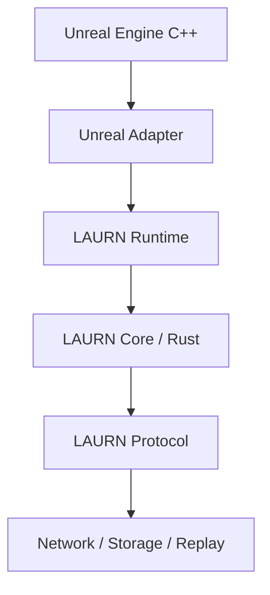

# LAURN — Verifiable State Infrastructure for Real-Time Systems

LAURN is a deterministic, verifiable state-transition runtime for real-time multiplayer and simulation systems.

It provides a common verification and state-synchronization layer that allows independently executing clients and servers to establish whether a state transition is consistent with an agreed simulation model, authority, epoch, policy, and prior verified state.

## Core Principles
1. **Deterministic where practical**: Identical logical inputs produce identical canonical state representations.
2. **Verifiable, not blindly trusted**: A verifier can determine whether a transition satisfies the protocol's requirements.
3. **Evidence over assertion**: LAURN never treats a claim of validity as equivalent to evidence of validity.
4. **Engine-independent core**: Built with a Rust core, initially targeting Unreal Engine via a C ABI integration.
5. **No mandatory blockchain/AI**: Relies on solid cryptography and deterministic verification.
6. **Production from First Implementation**: We do not use mocks, stubs, or placeholders for incomplete features.

## Architecture



## Setup & Building
- **MSRV**: Rust 1.75.0 (Stable toolchain)
- **Unreal Compatibility**: UE 5.3+

```bash
# Build the core library and tools
cargo build --workspace

# Run tests
cargo test --workspace
```

## Licensing
This project is licensed under the Apache 2.0 License. See the [LICENSE](LICENSE) file for details.
