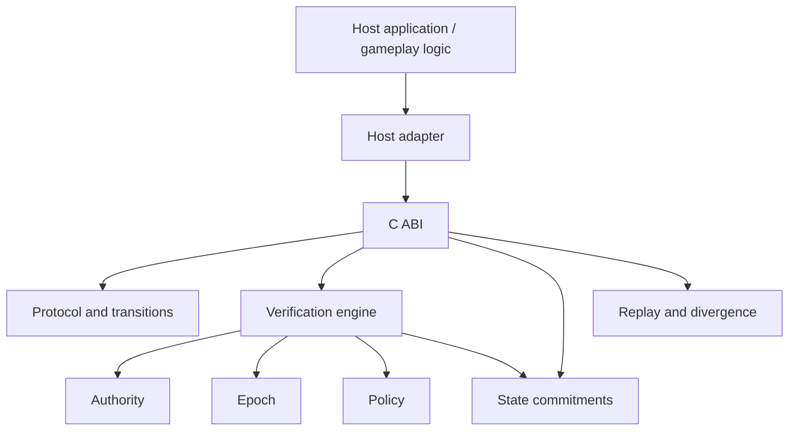

# LAURN

[](https://github.com/laurrybin/Laurn/actions)
[](https://opensource.org/licenses/Apache-2.0)


LAURN is a pre-alpha deterministic verification and replay architecture for state-transition systems. It provides engine-agnostic primitives for authenticated transitions, epoch and policy validation, canonical state commitments, replay protection, replay recording, and divergence analysis.

The host application remains responsible for domain-specific state execution. LAURN verifies the transition context and state commitments supplied around that execution rather than acting as a gameplay or simulation engine.

## Status

Current version: `0.1.0`

Maturity: **Pre-alpha**

The Rust verification path, replay primitives, C ABI, command-line tools, and Unreal adapter are implemented and under active development. API, ABI, packaging, and host-integration behavior may change before a stable release.

## Current implementation

The repository currently includes:

- Ed25519-backed authority identities, roles, capabilities, and signature verification
- explicit epoch registration, activation, closure, and transition-window validation
- policy evaluation for protocol version, transition class, capabilities, freshness, and evidence requirements
- signed transition representations with authenticated transition class and state commitments
- domain-separated BLAKE3 state commitments
- canonical numeric wrappers and fixed-point vector, quaternion, and transform representations
- persistent replay protection within a verification-engine instance
- replay recording, replay reading, and first-divergence analysis
- signed execution-evidence records with issuer-signature verification
- a handle-based C ABI for core lifecycle, protocol, verification, commitment, and replay operations
- a pre-alpha Unreal Engine adapter based on `UGameInstanceSubsystem` and tracked state components
- a fixed synthetic replay-divergence simulator
- replay dump, verifier-diagnostic, and divergence commands through `laurn-inspector`
- fuzz targets for protocol-message and delta parsing
- a benchmark suite under `tools/benchmarks`

Hardware-backed SGX and AWS Nitro attestation generation and verification are not yet implemented. Their current providers only detect the expected platform device and report unavailable native integration.

## Architecture

LAURN is split between the Rust core, a C-compatible integration boundary, and host adapters.



The host owns application-specific execution and rollback. A successful verification result means the supplied transition satisfied the configured verification checks; it does not mean LAURN executed or applied the host state change.

See [Architecture Overview](docs/architecture/index.md) for the current architecture and explicitly separated target architecture.

Detailed diagrams are available in the architecture documentation:

- [System architecture](docs/architecture/index.md#system-architecture)
- [Verification pipeline](docs/architecture/index.md#verification-pipeline)
- [Epoch lifecycle](docs/architecture/index.md#epoch-lifecycle)
- [Replay and divergence model](docs/architecture/index.md#replay-and-divergence-model)
- [Current versus target architecture](docs/architecture/index.md#current-versus-target-architecture)


## Quickstart

The repository uses the Rust toolchain configuration in `rust-toolchain.toml`.

```bash
git clone https://github.com/laurrybin/Laurn.git
cd Laurn

cargo build --workspace --exclude laurn-fuzz
cargo test --workspace --exclude laurn-fuzz
cargo fmt --all -- --check
cargo clippy --workspace --all-targets --all-features --exclude laurn-fuzz -- -D warnings
```

The normal validation commands above exclude `laurn-fuzz`. Fuzz targets are located under `fuzz/fuzz_targets` and are maintained separately from those stable-workspace checks.

If `cargo-deny` is installed, dependency and license policy can be checked with:

```bash
cargo deny check
```

## Simulator

The simulator runs a fixed synthetic scenario with three deterministic server-node fixtures. It injects an output-state commitment mismatch into one replay stream, verifies a server evidence signature, and checks that replay divergence analysis reports the injected mismatch.

```bash
cargo run --bin laurn-simulator
```

The simulator is a development diagnostic. It is not a performance benchmark, a hardware-attestation test, or a complete host-configured verification session.

See [Simulator and Inspector](docs/deployment/simulator.md) for the exact tool behavior and inspector commands.

## Unreal Engine

The Unreal adapter is under `unreal/Laurn`. The included example project under `examples/unreal` targets Unreal Engine 5.3.

The adapter currently provides tracked-state commitment generation, encoded transition verification, replay recording and reading, and divergence analysis. Gameplay application remains host-owned.

The public Unreal subsystem does not yet expose complete epoch orchestration or a complete configured accepted signed-transition flow. The current example focuses on malformed-message rejection and host-managed rollback.

The adapter also currently uses diagnostic authority registration and development-oriented Rust library linkage rather than production key provisioning and release packaging.

Unreal compilation is not performed by the current Rust CI workflow, so engine-level compatibility should be validated in an Unreal build environment.

See the [Unreal verification sequence](docs/api/unreal_integration.md#verification-sequence) and [Unreal Engine Integration](docs/api/unreal_integration.md) for current behavior and limitations.

## C ABI

The C ABI is exposed by `bindings/c` and declared for the Unreal integration in `unreal/Laurn/Source/Laurn/Public/laurn.h`.

It provides explicit handle lifecycle operations for authority, epoch, policy, verification, transition, message, and replay state. Callers are responsible for following the documented ownership, allocation, and lifetime rules.

The ABI is pre-alpha and binary or source compatibility is not yet guaranteed across releases.

See [C ABI Reference](docs/api/c_abi_reference.md).

## Repository structure

- `core/` — authority, commitment, delta, epoch, evidence, math, policy, replay, state, transition, verification, and version crates
- `protocol/` — LAURN protocol representation and serialization
- `bindings/c/` — C ABI for native host integration
- `tools/simulator/` — fixed replay-divergence diagnostic
- `tools/inspector/` — replay inspection and comparison CLI
- `tools/benchmarks/` — Criterion benchmarks
- `unreal/Laurn/` — Unreal Engine adapter
- `examples/unreal/` — Unreal Engine 5.3 example project
- `fuzz/` — cargo-fuzz targets and corpora
- `docs/` — architecture, ADRs, API references, and tooling documentation

## Verification and CI

The workspace enables strict Clippy lint groups and denies unsafe Rust by default. The C ABI crate explicitly scopes the unsafe operations required at the FFI boundary.

GitHub Actions is configured to run formatting and Clippy checks, `cargo-deny`, and Rust workspace build/test jobs across Ubuntu, Windows, and macOS. The Unreal plugin is not built by that workflow.

For local validation of the normal stable workspace:

```bash
cargo fmt --all -- --check
cargo check --workspace --exclude laurn-fuzz
cargo test --workspace --exclude laurn-fuzz
cargo clippy --workspace --all-targets --all-features --exclude laurn-fuzz -- -D warnings
```

## Target architecture

The longer-term architecture extends the current verification boundary with:

- Unreal-facing epoch orchestration
- production authority and key provisioning
- tooling for constructing configured accepted signed transitions
- transactional host state-application hooks
- native Intel SGX and AWS Nitro attestation generation and verification
- richer replay integration with execution evidence and domain-specific state reconstruction
- release-grade Unreal packaging and automated engine build validation
- additional host-engine adapters through the C ABI

These are planned directions, not current implemented capabilities. The detailed split between current and target architecture is maintained in [Architecture Overview](docs/architecture/index.md).

## Documentation

- [Architecture Overview](docs/architecture/index.md)
- [C ABI Reference](docs/api/c_abi_reference.md)
- [Unreal Engine Integration](docs/api/unreal_integration.md)
- [Simulator and Inspector](docs/deployment/simulator.md)
- [ADR 0001: Use Rust for Core Logic](docs/architecture/adr/0001-use-rust-for-core-logic.md)
- [ADR 0002: Unreal Engine C ABI Integration](docs/architecture/adr/0002-unreal-engine-c-abi-integration.md)
- [ADR 0003: Deterministic Numeric Representations](docs/architecture/adr/0003-deterministic-fixed-point-math.md)

## Contributing and security

Contribution guidance is available in [CONTRIBUTING.md](CONTRIBUTING.md), and the project code of conduct is in [CODE_OF_CONDUCT.md](CODE_OF_CONDUCT.md).

Security reporting guidance is available in [SECURITY.md](SECURITY.md).

## License

LAURN is licensed under the Apache License 2.0. See [LICENSE](LICENSE).
