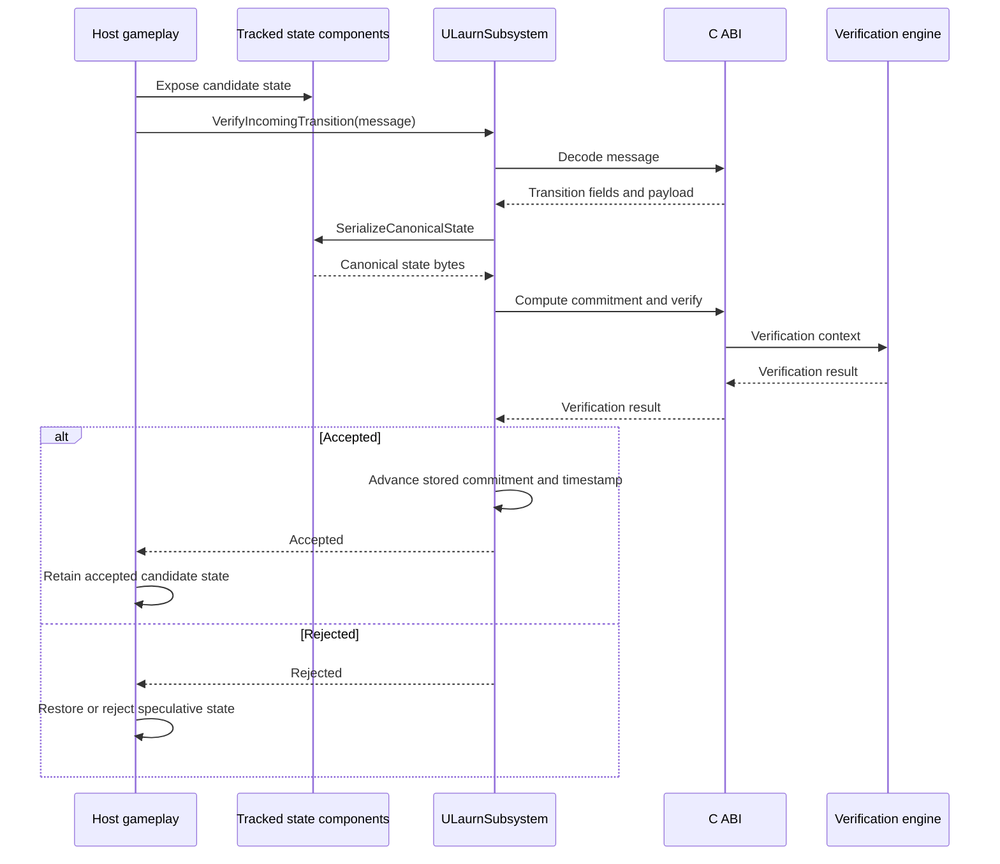

# Unreal Engine Integration

Status: Pre-alpha.

The Unreal adapter under `unreal/Laurn` integrates the Rust verification core through the LAURN C ABI. The current adapter provides tracked-state commitment generation, transition-message decoding and verification, replay recording and reading, and replay divergence analysis. Gameplay execution remains host-owned.

## Subsystem access

`ULaurnSubsystem` is a `UGameInstanceSubsystem`.

```cpp
UGameInstance* GameInstance = GetWorld()->GetGameInstance();
ULaurnSubsystem* LaurnSubsystem = GameInstance->GetSubsystem<ULaurnSubsystem>();
```

During `Initialize`, the subsystem creates authority, epoch, policy, and verification-engine handles. During `Deinitialize`, it releases those handles and active replay resources.

The subsystem currently registers the deterministic diagnostic authority during initialization. That supports diagnostics and integration work; it is not production authority or key provisioning.

## Tracked state

Attach `ULaurnStateComponent` to actors whose state contributes to the tracked Unreal commitment.

The component registers during `BeginPlay` and unregisters during `EndPlay`.

`SerializeCanonicalState` encodes each component record from:

- `StateId` as an unsigned 32-bit little-endian value
- a transform-presence byte
- six quantized signed 32-bit transform values when transform tracking is present
- the `CustomStateData` length as an unsigned 32-bit little-endian value
- the `CustomStateData` bytes

Before hashing, the subsystem builds a framed canonical byte stream. It begins with the eight-byte `LAURNST1` marker and the non-null component count as an unsigned 32-bit little-endian value. Components are sorted by `StateId`, each serialized component record is prefixed by its unsigned 32-bit little-endian record length, and duplicate state identifiers cause commitment generation to fail.

Applications are responsible for assigning stable, unique state identifiers and defining any additional canonical application state.

## Verification state

The subsystem stores the last accepted canonical commitment and transition timestamp.

Registration or removal of tracked components refreshes the stored commitment. `ComputeGlobalStateCommitment` computes a commitment from the current tracked Unreal state and does not mutate gameplay state.

## Transition verification

`VerifyIncomingTransition` accepts an encoded LAURN protocol message.

The current path:

1. requires an initialized canonical commitment
2. decodes the message
3. extracts transition, signature, raw payload, protocol version, class, and timestamp
4. computes the commitment of the current tracked Unreal state
5. uses the previously accepted commitment as the expected input state
6. uses the current tracked-state commitment as the host-generated output state
7. delegates verification to the Rust verification engine
8. advances stored commitment and timestamp only after success
9. records the accepted payload and output commitment when replay recording is active

LAURN does not execute gameplay inside `VerifyIncomingTransition`.

For a state-changing transition, the host must make the candidate output state visible through registered state components before verification. If verification fails, host code is responsible for restoring or rejecting that speculative state. If verification succeeds, host code decides how the accepted state remains integrated into gameplay.

## Verification sequence

For state-changing transitions, host code makes the candidate state visible through registered LAURN state components before calling `VerifyIncomingTransition`. LAURN verifies the resulting commitment and transition context; host code owns acceptance behavior and rollback.



## Epoch lifecycle

The Rust C ABI implements epoch registration, activation, and closure.

The current public `ULaurnSubsystem` API does not expose Unreal-facing epoch lifecycle methods, and its epoch-engine handle is private.

Complete host-configured acceptance of signed state-changing transitions is therefore not yet exposed end to end through the public Unreal subsystem. The current example demonstrates the rejection and host-rollback path rather than a configured accepted-transition flow.

## Replay

The subsystem exposes:

- `StartRecording`
- `StopRecording`
- `StartReplay`
- `TickReplay`
- `AnalyzeDivergence`

Recording starts from the current tracked-state commitment. Successful verification adds the raw payload and generated output-state commitment. Replay reading advances through recorded payloads, while divergence analysis compares two replay streams.

Replay does not by itself reconstruct or apply gameplay state.

## Current limitations

The Unreal adapter currently has:

- no public Unreal-facing epoch orchestration
- deterministic diagnostic authority registration instead of production authority provisioning
- no public Unreal helper for a complete accepted signed-transition flow
- host-managed speculative state application and rollback
- no native SGX or AWS Nitro attestation integration
- Rust library linkage from the workspace `target/debug` directory
- no release-grade plugin packaging workflow

## Target integration

The target Unreal integration adds explicit epoch APIs, production authority provisioning, signed-transition construction tooling, transactional state-application hooks, release artifact selection, automated Unreal build validation, and release-grade plugin packaging.

These items describe planned integration direction rather than current implemented capability.
