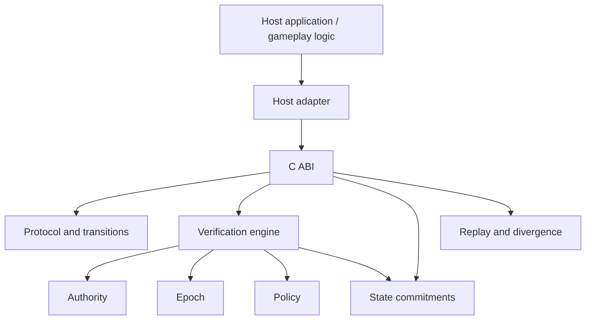
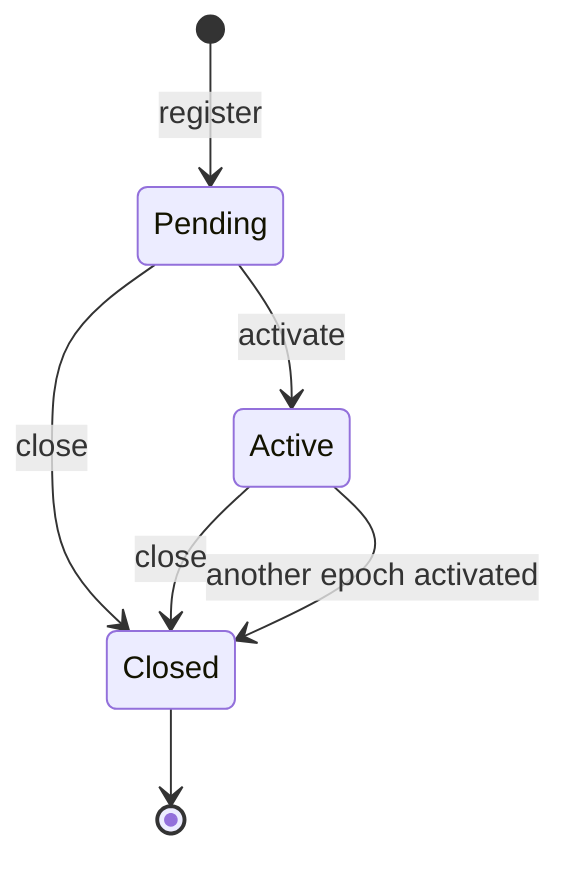
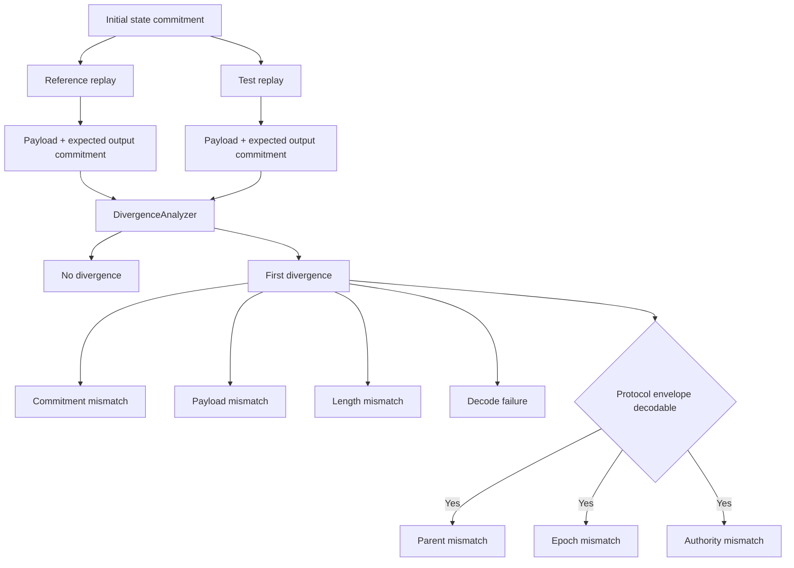
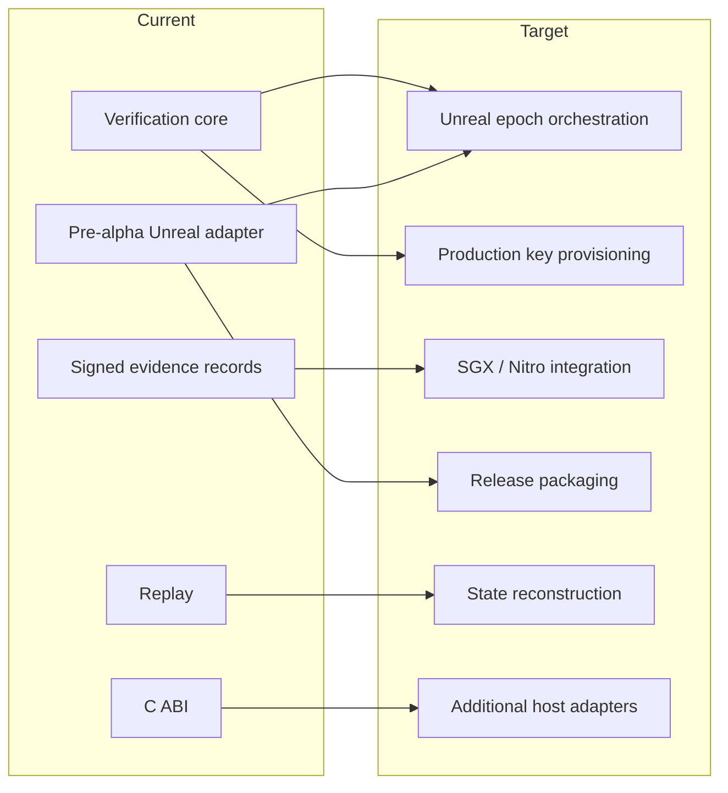

# Architecture Overview

LAURN is a deterministic verification and replay architecture for state-transition systems. The current implementation focuses on authenticated transition metadata, epoch and policy validation, canonical commitments, replay protection, divergence analysis, and host integration through a C ABI.

The host application owns domain-specific state execution. LAURN verifies the transition context and commitments supplied around that execution.

## System architecture

The current system separates host-owned execution from LAURN verification and replay services.

## Current architecture

### Authority

`core/authority` defines Ed25519-backed authority identifiers, roles, capabilities, and optional epoch session bindings.

Authorities are registered with `AuthorityEngine`. Verification uses the authority public key to authenticate the signed transition representation and policy checks can require specific capabilities.

### Epochs

`core/epoch` models explicit verification windows.

An epoch has:

- a unique identifier
- a start timestamp
- an expiration timestamp
- pending, active, or closed status
- an initial state commitment

Only one epoch is active at a time. Activating a new epoch closes the previously active epoch.

Epochs constrain when a transition may be accepted. They do not represent automatic simulation-frame execution.

#### Epoch lifecycle

### Transitions

`core/transition` defines transition identifiers, metadata, input and output state commitments, and transition classes.

The signed representation binds transition metadata and commitments so that changes to authenticated fields invalidate the signature.

The verification engine does not execute an application-specific transition. The host supplies the state commitments associated with its execution path.

### State and deltas

`core/state` provides deterministic serialization primitives and a key-value state implementation.

`core/delta` defines engine-agnostic semantic delta operations and the `DeltaApplicable` trait. A host or domain implementation may use this trait to apply deltas to its own state representation.

Delta application is not automatically performed by the verification engine or Unreal adapter.

### Deterministic math

`core/math` contains two complementary forms of deterministic representation:

- canonical `f32` and `f64` wrappers that reject non-finite values and normalize negative zero
- fixed-point vector, quaternion, and transform types based on `I48F16`

These primitives reduce sources of representation drift. Deterministic behavior of a complete host simulation still depends on the host, its serialization rules, and the operations included in the verified state boundary.

### Commitments

`core/commitment` computes domain-separated BLAKE3 commitments.

A `StateCommitment` is a 32-byte commitment to caller-provided canonical state bytes. Identical canonical bytes under the same domain separator produce the same commitment.

Canonicalization occurs before the commitment operation. The commitment engine does not infer or normalize arbitrary application objects.

### Verification

`core/verification` coordinates authority, epoch, policy, transition, state-continuity, protocol-version, transition-class, and replay-protection checks.

The verifier receives both the expected input-state commitment and a host-generated output-state commitment.

A successful result means the supplied transition satisfied the configured verification checks. It does not mean LAURN executed or applied the host gameplay transition.

#### Verification pipeline

Protocol decoding occurs before the core verifier is invoked. The C ABI validates transition-class bits before constructing the verification context. The core then evaluates the checks in the current implementation order.

After a valid result, the C ABI records the transition identifier in the verification-engine replay buffer.

```mermaid
flowchart LR
    Message[Encoded transition message]
    Decode[Protocol decode]
    Class[Transition-class validation]
    Size[Payload-size bound]
    Replay[Duplicate replay check]
    Parent[Parent-state continuity]
    EpochCheck[Epoch validation]
    Signature[Authority signature]
    PolicyCheck[Policy evaluation]
    Integrity[Payload commitment + output-state integrity]
    Result[Verification result]
    Record[Record transition ID]

    Message --> Decode
    Decode --> Class
    Class --> Size
    Size --> Replay
    Replay --> Parent
    Parent --> EpochCheck
    EpochCheck --> Signature
    Signature --> PolicyCheck
    PolicyCheck --> Integrity
    Integrity --> Result
    Result -->|Valid| Record
```

### Evidence

`core/evidence` defines signed `ExecutionEvidence` records and evidence types for server, Intel SGX, and AWS Nitro environments.

The current implementation verifies the issuer Ed25519 signature over the evidence binding payload.

The SGX and Nitro platform providers detect whether the expected platform device is present but do not yet integrate the native SGX SDK or Nitro NSM library. Hardware attestation verification is therefore not currently complete.

### Replay and divergence analysis

`core/replay` records an initial state commitment and a sequence of frames. Each frame stores:

- raw payload bytes
- expected output-state commitment

`DivergenceAnalyzer` compares two replay streams and reports the first difference it can classify. Frame-count, payload, output-state commitment, and decode differences do not require a protocol envelope. Parent-state, epoch, and authority classification requires the differing replay payloads to decode as serialized `LaurnMessage` values.

The current Unreal adapter records the inner application payload rather than the full serialized protocol message, so parent-state, epoch, and authority classifications are not reliably available for Unreal-produced replays. Such differences can instead surface as payload, commitment, or decode differences.

Replay currently provides recording, reading, and comparison. It does not automatically reconstruct arbitrary application state or embed execution evidence in each frame.

#### Replay and divergence model

### C ABI

`bindings/c` exposes the Rust engines through an explicit handle-based C ABI.

The ABI is the integration boundary used by the Unreal adapter and is designed so that other hosts can integrate without depending directly on Rust types.

### Unreal adapter

`unreal/Laurn` provides a `UGameInstanceSubsystem` and tracked-state actor component.

The adapter currently:

- creates and owns the Rust engine handles
- registers tracked Unreal state components
- computes the tracked-state commitment
- decodes and verifies LAURN transition messages
- maintains the last accepted commitment and timestamp
- records and reads replay data
- performs replay divergence analysis

Gameplay application remains host-owned.

## Current versus target architecture

The target architecture extends the current implementation without changing the current host-owned execution boundary.

## Target architecture

The broader LAURN architecture is intended to extend the current verification boundary with:

- explicit Unreal-facing epoch orchestration
- host tooling for constructing accepted signed transitions
- production authority and key provisioning
- native Intel SGX and AWS Nitro attestation generation and verification
- richer replay integration with evidence and domain-specific state reconstruction
- release-grade Unreal packaging and automated engine build validation
- additional host-engine adapters through the C ABI

These items describe architectural direction and should not be read as current implemented capabilities.
